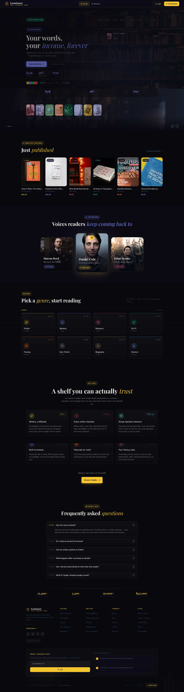
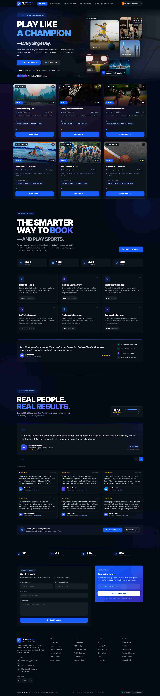

<div align="center">


<a href="https://www.linkedin.com/in/sahidul-islam-">
  
</a>
<a href="https://github.com/sahidul-dev-47">
  
</a>
<a href="https://www.facebook.com/share/17ANiUNLmA/">
  
</a>

</div>

<br/>

## 👋 About Me

I'm a **Full-Stack Web Developer** specializing in the **MERN stack** — I design, build, and deploy complete production-grade applications, not just demos. Every project on this profile is **live, deployed, and fully functional**, covering secure authentication, real payment systems, role-based access, and clean, responsive UI.

```txt
const sahidul = {
  role: "Full-Stack Web Developer (MERN)",
  focus: ["Next.js", "Express.js", "MongoDB", "Secure Auth Systems"],
  currentlyBuilding: "Production-ready SaaS-style web platforms",
  location: "Bangladesh 🇧🇩",
  openTo: ["Internship", "Junior Role", "Freelance Projects"],
};
```

- 🔭 Building full-stack apps with **Next.js**, **Express.js**, and **MongoDB**
- 🔐 Comfortable with modern auth: **JWT**, **Better Auth**, **Google OAuth**
- 💳 Experience integrating **real payment systems** (Stripe) into production apps
- 🚀 Every project is **deployed and live** — no "localhost only" work
- 💬 Open to **internship**, **junior**, or **freelance** opportunities

<br/>

## 🛠️ Tech Stack

<div align="center">

**Frontend**
<br/>


**Backend & Database**
<br/>


**Auth, Payments & Tools**
<br/>


</div>

<br/>

## 🚀 Pinned Projects

<br/>

### 📚 Luminary — Ebook Sharing Platform

<!-- 📸 Add screenshot here:  -->

> A full-stack ebook marketplace connecting readers with independent writers. Readers discover and purchase original ebooks; writers publish and manage their own catalog — all through role-based dashboards with real Stripe payments.

**Key Features:** Role-based dashboards (Reader / Writer / Admin) · Stripe-powered purchases & writer verification · JWT + Google OAuth · Search, filter, sort & pagination · Admin analytics with revenue & genre charts · Framer Motion animations

**Tech:** `Next.js` `Node.js` `Express.js` `MongoDB` `Tailwind CSS` `Stripe` `Better Auth` `Framer Motion`

<div>

[](https://luminary-client.vercel.app/)
[](https://github.com/sahidul-dev-47/luminary-client)

</div>

---

<br/>

### 🏟️ SportVerse — Sports Facility Booking Platform

<!-- 📸 Add screenshot here:  -->

> A full-stack platform where venue owners list their sports facilities and athletes book time slots directly — no phone calls, no middlemen.

**Key Features:** JWT-secured REST API · Google OAuth · 4-step animated facility listing form · Owner dashboard (add/edit/delete venues) · Booking history with cancellation · Dark glassmorphism UI

**Tech:** `Next.js 15` `Tailwind CSS` `Framer Motion` `Express.js` `MongoDB` `Better Auth` `JWT`

<div>

[](https://sport-verse-client.vercel.app/)
[](https://github.com/sahidul-dev-47/SportVerse-client)

</div>

---

<br/>

### 💻 Pro Coder BD — Coding Practice Platform

<!-- 📸 Add screenshot here:  -->

> A community-driven coding platform built for Bangladeshi developers to learn, practice, and grow together — with real-time code execution, structured challenges, and a peer community.

**Key Features:** Coding challenges with real-time code execution · JWT authentication · Community forum with threaded discussions · Leaderboard & achievement system · Admin dashboard for content management · Mobile-responsive

**Tech:** `Next.js` `React` `Node.js` `MongoDB` `Tailwind CSS` `Better Auth` `Google Auth`

<div>

[](https://skillsphere-app-l97u.vercel.app/)
[](https://github.com/sahidul-dev-47/skillsphere-app)

</div>

<br/>

## 📊 GitHub Stats

<div align="center">


</div>

<div align="center">

</div>

<br/>

## 📬 Let's Connect

<div align="center">

[](https://www.linkedin.com/in/sahidul-islam-)
[](https://github.com/sahidul-dev-47)
[](https://www.facebook.com/share/17ANiUNLmA/)

</div>

<div align="center">


</div>
