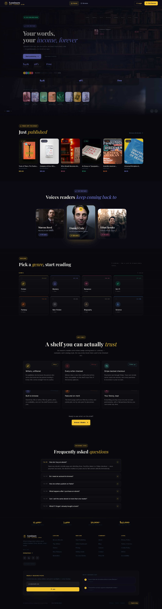

<div align="center">


<a href="https://www.linkedin.com/in/sahidul-islam-">
  
</a>
<a href="https://github.com/sahidul-dev-47">
  
</a>
<a href="https://www.facebook.com/share/17ANiUNLmA/">
  
</a>

</div>

<br/>

## 👋 About Me

I'm a **Full-Stack Web Developer** specializing in the **MERN stack** — I design, build, and deploy complete production-grade applications, not just demos. Every project on this profile is **live, deployed, and fully functional**, covering secure authentication, real payment systems, role-based access, and clean, responsive UI.

```txt
const sahidul = {
  role: "Full-Stack Web Developer (MERN)",
  focus: ["Next.js", "Express.js", "MongoDB", "Secure Auth Systems"],
  currentlyBuilding: "Production-ready EdTech & Community-driven platforms",
  currentlyLearning: "Advanced system design & scalable architectures",
  location: "Bangladesh 🇧🇩",
  openTo: ["Full-Time Job", "Freelance Projects"],
};
```

- 🔭 Building full-stack apps with **Next.js**, **Express.js**, and **MongoDB**
- 🔐 Comfortable with modern auth: **JWT**, **Better Auth**, **Google OAuth**
- 💳 Experience integrating **real payment systems** (Stripe) into production apps
- 🚀 Every project is **deployed and live** — no "localhost only" work
- 💬 Open to **Full-Time Job** and **Freelance Projects**

<br/>

## 🛠️ Tech Stack

<div align="center">

**Frontend**
<br/>


**Backend & Database**
<br/>


**Auth, Payments & Tools**
<br/>


</div>

<br/>

## 🚀 Pinned Projects

<br/>

### 🎓 EduraCore — Modern English Learning Platform

> A comprehensive EdTech platform designed for Bengali-speaking learners to build practical English communication skills with situational dialogues, audio pronunciation reflexes, and mastery-gated learning modules.

**Key Features:** Interactive situational spoken dialogues · Native US accent pronunciation audio reflex · 80% mastery-gated topic unlocking · Dual curriculum tracks (General & Madrasah) · Verified digital completion certificates · Mobile-optimized responsive design

**Tech:** `Next.js` `React` `Tailwind CSS` `Node.js` `Express.js` `MongoDB`

<div>

[](https://www.eduracore.com/)
[](https://github.com/sahidul-dev-47)

</div>

<details>
  <summary>📸 <b>Click to view full landing page screenshot</b></summary>
  <br/>
  <a href="./assets/eduracore%20home%20page.png" target="_blank" title="Click to view full size">
    
  </a>
  <sub align="center"><i>(Click image to open in full resolution)</i></sub>
</details>

---

<br/>

### 🩸 Shahrasti Blood Donors — Community Blood Donation Network

> A localized life-saving blood donation network connecting recipients with voluntary donors across 10 unions in Shahrasti Upazila with verified organizations and direct contact coordination.

**Key Features:** Union & blood group-based donor directory · Verified local organization directory · Secure contact access with authentication · Multi-step voluntary donor registration · Clean responsive UI with vital health guidelines

**Tech:** `Next.js` `React` `Node.js` `Express.js` `MongoDB` `Tailwind CSS`

<div>

[](https://www.shahrastiblood.com/)
[](https://github.com/sahidul-dev-47/BloodBridge-client)

</div>

<details>
  <summary>📸 <b>Click to view full landing page screenshot</b></summary>
  <br/>
  <a href="./assets/shahrasti%20blood%20donars%20home%20page.png" target="_blank" title="Click to view full size">
    
  </a>
  <sub align="center"><i>(Click image to open in full resolution)</i></sub>
</details>

---

<br/>

### 📚 Luminary — Ebook Sharing Platform

> A full-stack ebook marketplace connecting readers with independent writers. Readers discover and purchase original ebooks; writers publish and manage their own catalog — all through role-based dashboards with real Stripe payments.

**Key Features:** Role-based dashboards (Reader / Writer / Admin) · Stripe-powered purchases & writer verification · JWT + Google OAuth · Search, filter, sort & pagination · Admin analytics with revenue & genre charts · Framer Motion animations

**Tech:** `Next.js` `Node.js` `Express.js` `MongoDB` `Tailwind CSS` `Stripe` `Better Auth` `Framer Motion`

<div>

[](https://luminary-client.vercel.app/)
[](https://github.com/sahidul-dev-47/luminary-client)

</div>

<details>
  <summary>📸 <b>Click to view full landing page screenshot</b></summary>
  <br/>
  <a href="./assets/luminary.png" target="_blank" title="Click to view full size">
    
  </a>
  <sub align="center"><i>(Click image to open in full resolution)</i></sub>
</details>

<br/>

## 📊 GitHub Metrics

<div align="center">


</div>

<sub align="center">↑ Auto-generated daily via GitHub Actions — always up to date, no third-party downtime.</sub>

<br/>

## 📬 Let's Connect

<div align="center">

[](https://www.linkedin.com/in/sahidul-islam-)
[](https://github.com/sahidul-dev-47)
[](https://www.facebook.com/share/17ANiUNLmA/)

</div>

<div align="center">


</div>
